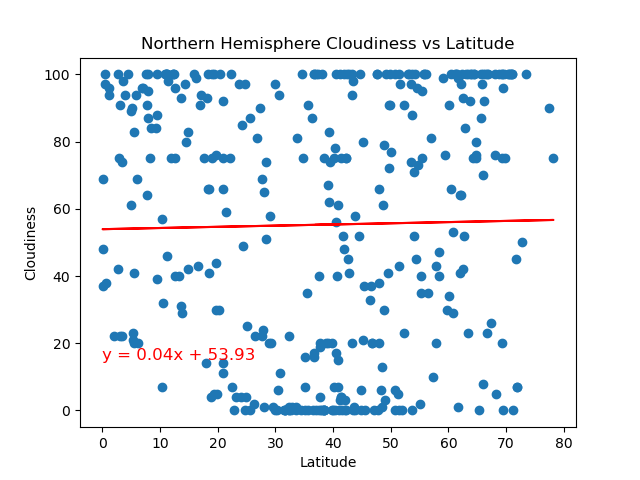

# API Challenge -

### This repository explores changes to weather locations as we get closer to the equator
- See output_data for data files and images of charts created.  

### Part 1: WeatherPy
In this deliverable, we create a Python script to visualise the weather of over 500 cities of varying distances from the equator.   
We then looked at trends across different metrics for both the Northern and Southern Hemisphere:

## Maximum Temperature

In the Northern Hemisphere there is a negative relation ship between the latitude and the Maximum Temp.  
We see the inverse in the southern hemisphere with a positive relationship between the latitude and the Maximum Temp.

 

## Humidity

There is an invers linear relationship between the Latitude and the Humidity in the north andd sourthern hemispher.   
here is a slight positive relationship betwen Humidity and lattitude in the northern hemispher.     
As the value of the latitude increases by 1, Humidity will increase by 0.06.     
There is a slight negative relationship between Humditty and latitude in the southern hemisphere. As the value of the latidue increases by 1, Humidity will decrease by 0.07.  

 

## Cloudiness

In the northern hemisphere there is a very slight negative relationship between Latitude and couldiness- almost at 0.    
In the southern hemisphere thers is a slight positive relationship between latitude and couldeness an increase of 0.24 per increase in Latitude.

 

## Wind Speed

There is a similar negative relationship of Wind Speed and Latitude in both the northern and southern hemisphere.   
The slope of the relationship in the southern hemisphere is slightely steeper -0.06 than the northern hemisphiere 0.01  

 

## Part 2: VacationPy
In this deliverable, we use your weather data skills to plan future vacations. Also, you'll use Jupyter notebooks, the geoViews Python library, and the Geoapify API.

See below for example of ideal holidaty location.  

